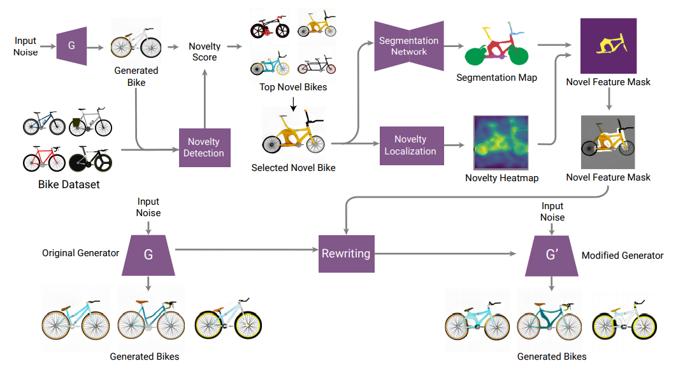
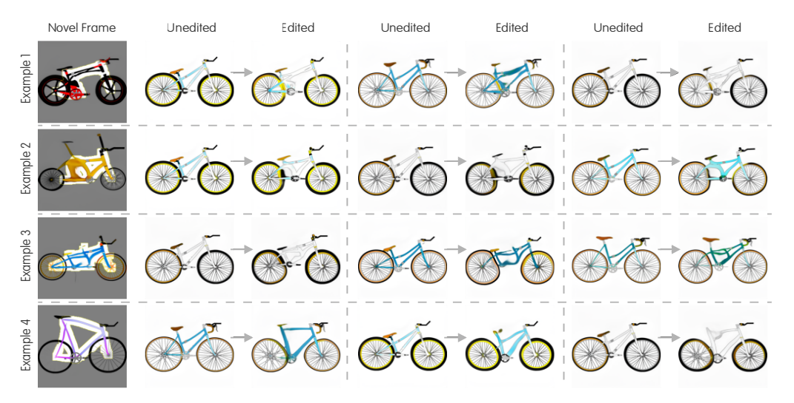
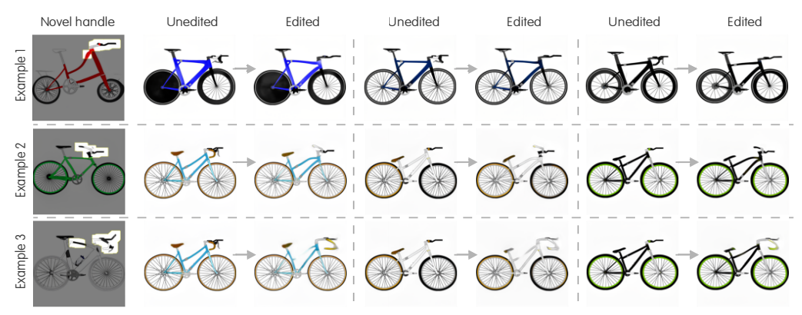
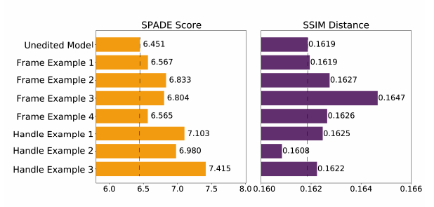

# CreativeGAN
Experiment code associated with the paper [CreativeGAN: Editing Generative Adversarial Networks for Creative Design Synthesis](https://arxiv.org/abs/2103.06242)




  <p>
    <a href="https://arxiv.org/abs/2103.06242">Paper</a>
    ·
    <a href="http://decode.mit.edu/projects/creativegan/">Project Page</a>
    ·
    <a href="https://colab.research.google.com/drive/1M_Uz3HBLAj1LoEdc1Ppwu9D_zy_h5VF2?usp=sharing">Colab Notebook</a>
  </p>
</p>


<!-- ABOUT THE PROJECT -->
# Setup
Run the setup script to setup the conda environment.
```
./setup/setup_renv.sh
```

Download the the pretrained models and dataset using the download script.
```
./download.sh
```
The script will download a stylegan and segmentation model. It will also download the bike dataset used alongside a small test dataset that you can use try first to make sure the code is working (using the complete dataset may require high memory for the anomaly detection).
# Usage
Run the following python script.
```
python creativegan.py --name <name of experiment> \
                       --model_path <stylegan model path> \
                       --seg_model_path <segmentation model path> \
                       --seg_channels <segmentation channels to be considered in anomaly detection>\
                       --data_path '<dataset path>' \
                       --copy_id <seed id of target copy> \
                       --paste_id <seed id of target paste> \
                       --context_ids <seed ids of contexts (comma separated or range)> \
                       --layernum <layer to be edited>
```

Exampe usage:
```
python creativegan.py --name "bike" \
                       --model_path "./models/stylegan2_bike.pt" \
                       --seg_model_path './models/segmentation_bike.pt' \
                       --seg_channels 0,3 \
                       --data_path './datasets/test_data' \
                       --copy_id 907 \
                       --paste_id 7 \
                       --context_ids 7-12 \
                       --layernum 6
``` 


For more optional arguments, refer to help command.
```
python creativegan.py --help
```

# Experiment
Run the experiment script.
```
./experiment.sh
```
The output will be in `rewriting_result` folder.
# Result
Experiment Result



<br>
Quantitative Result



# License
This code is licensed under the MIT license. Feel free to use all or portions for your research or related projects so long as you provide the following citation information:

	@misc{nobari2021creativegan,
      title={CreativeGAN: Editing Generative Adversarial Networks for Creative Design Synthesis}, 
      author={Amin Heyrani Nobari and Muhammad Fathy Rashad and Faez Ahmed},
      year={2021},
      eprint={2103.06242},
      archivePrefix={arXiv},
      primaryClass={cs.LG}
    }


Part of the code is adapted from [David Bau's repository](https://github.com/davidbau/rewriting).